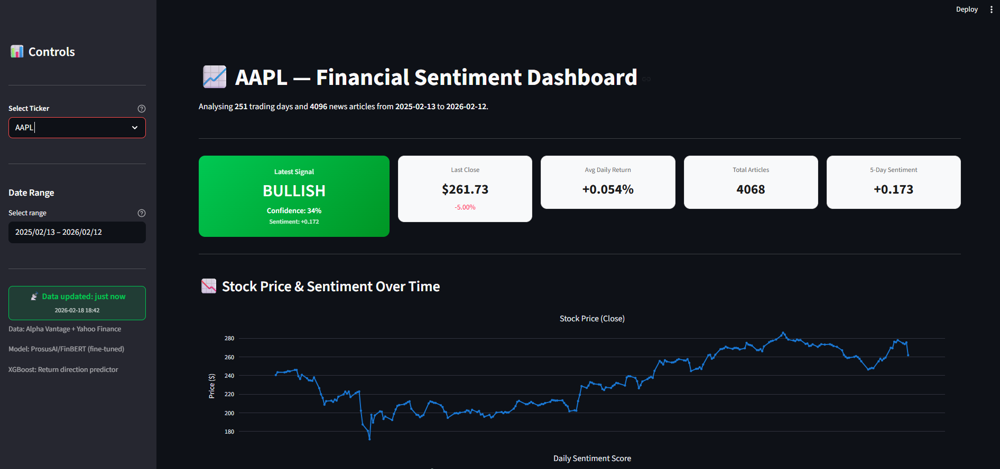

# Financial Sentiment Analysis for Trading Signals

> **FinBERT + XGBoost** pipeline that scores financial news sentiment and predicts stock return direction across **3 horizons** (daily / weekly / monthly), presented through an interactive **Streamlit** dashboard covering **19 tickers** across 6 sectors.

<!-- Replace with an actual screenshot or GIF of your dashboard -->
<!-- To capture: run the dashboard, take a screenshot, save as docs/dashboard_preview.png -->
<p align="center">
  
  <br>
  <em>Interactive Streamlit dashboard with 10 analytical panels</em>
</p>

<!-- Uncomment once deployed -->
<!-- [**🚀 Live Demo**](https://your-deployment-url.streamlit.app) -->

## Features

- **FinBERT Sentiment Analysis** — Fine-tuned ProsusAI/FinBERT model scores headlines as positive / negative / neutral with calibrated confidence
- **Multi-Horizon XGBoost Predictor** — Predicts return direction (UP / DOWN) over 1-day, 5-day, and 20-day horizons using 38 lagged features (sentiment + price + technical), validated with walk-forward cross-validation (no lookahead bias)
- **22 Technical Indicators** — RSI-14, MACD (line + signal + histogram), Bollinger %B + width, ATR-14, 52-week high/low distance, volume z-score, Stochastic %D, OBV slope, EMA cross, ADX-14, CCI-20, MFI-14, ROC-10, VWAP distance
- **VIX Market Fear Index** — CBOE VIX integrated as a cross-market risk feature
- **19 Tickers, 6 Sectors** — Tech (AAPL, MSFT, GOOGL, AMZN, NVDA, META), Finance (JPM, GS, BAC), Healthcare (JNJ, UNH, PFE), Consumer (TSLA, WMT, KO), Energy (XOM, CVX), Industrial (CAT, BA)
- **Live News Pipeline** — Aggregates headlines from 3 sources (Google News RSS, Yahoo Finance RSS, yfinance API) with disk caching
- **Interactive Dashboard** — Streamlit app with 10 panels:
  1. Signal card + key metrics (bullish / bearish / neutral)
  2. Dual-axis price + sentiment chart (Plotly)
  3. Historical news feed with sentiment scores
  4. Sentiment distribution (donut + histogram)
  5. Correlation analysis (scatter + Pearson / Spearman)
  6. Live headlines scored by FinBERT in real time
  7. Multi-ticker comparison (up to 6 tickers side-by-side)
  8. Alert simulation panel (rule-based BUY / SELL / HOLD engine)
  9. XGBoost prediction panel (next-day direction, feature importance, walk-forward accuracy)
  10. Multi-horizon panel (daily / weekly / monthly predictions, comparison chart, per-ticker heatmap)
- **Impact Ranking** — Headlines ranked by `|score| x confidence` with top-5 chart
- **Rule-Based Alert Engine** — 4 configurable thresholds, 6 signal levels (STRONG BUY to STRONG SELL)

## Model Performance (Walk-Forward Validation)

| Horizon | XGBoost | Naive Baseline | Lift | F1 | AUC |
|---------|---------|----------------|------|------|------|
| Daily (1-day) | **52.9%** | 53.3% (always UP) | −0.4% | 62.9% | 51.5% |
| Weekly (5-day) | **63.4%** | 57.7% (always UP) | **+5.7%** | 70.4% | 66.8% |
| Monthly (20-day) | **72.6%** | 64.0% (always UP) | **+8.6%** | 81.7% | 73.0% |

> **Naive baseline** = always predict the majority class (UP). The market had a bullish bias during this period (53–64% of days were UP), so any useful model must beat these numbers. The 1d model is at baseline — expected given only 2/19 tickers have sentiment data. The 5d and 20d models show meaningful lift, especially monthly (+8.6%), driven by technical indicators and VIX.

All metrics from walk-forward (expanding window) validation with no lookahead bias across 19 tickers and 251 trading days. Feature set: 38 features (9 sentiment + 3 price + 19 technical + 7 engineered).

## Project Structure

```
financial-sentiment-analysis/
├── dashboard/
│   └── app.py                  # Streamlit dashboard (10 panels)
├── data/
│   ├── cache/                  # Disk-cached live news (auto-generated)
│   ├── processed/              # Merged price + sentiment CSVs
│   └── raw/                    # Raw news & price CSVs (19 tickers + VIX)
├── models/
│   └── saved_models/
│       ├── finbert_finetuned/  # Fine-tuned FinBERT checkpoint
│       ├── xgboost_return_1d/  # Daily return predictor
│       ├── xgboost_return_5d/  # Weekly return predictor
│       └── xgboost_return_20d/ # Monthly return predictor
├── notebooks/
│   ├── evaluation/             # News/price exploration, baseline, FinBERT eval
│   ├── exploratory/
│   │   └── 01_sentiment_price_eda.ipynb  # EDA story: sentiment × price dynamics
│   └── modeling/               # FinBERT fine-tuning notebook
├── reports/
│   └── metrics/                # Training reports & walk-forward metrics
├── scripts/
│   ├── download_news.py        # Fetch historical news (Alpha Vantage)
│   ├── download_prices.py      # Fetch historical prices (yfinance, 19 tickers)
│   ├── train_xgboost.py        # Train single-horizon XGBoost predictor
│   ├── train_multihorizon.py   # Train 1d/5d/20d models in one run
│   └── tune_xgboost.py         # Optuna hyperparameter optimization
├── src/
│   ├── data/
│   │   ├── data_loader.py      # Load, merge, technical indicators, VIX
│   │   ├── news_fetcher.py     # Live RSS + yfinance news pipeline
│   │   └── preprocessor.py     # Text cleaning & normalisation
│   ├── models/
│   │   ├── sentiment_analyzer.py  # FinBERT wrapper
│   │   └── return_predictor.py    # XGBoost multi-horizon predictor
│   └── predictor.py            # High-level get_sentiment() facade
├── tests/
├── requirements.txt
└── README.md
```

## Getting Started

### Prerequisites

- Python 3.10+
- ~500 MB disk space for the FinBERT model weights

### Installation

```bash
# Clone the repo
git clone <repo-url>
cd financial-sentiment-analysis

# Create & activate virtual environment
python -m venv venv
venv\Scripts\activate        # Windows
# source venv/bin/activate   # Mac/Linux

# Install dependencies
pip install -r requirements.txt
```

### Run the Dashboard

```bash
streamlit run dashboard/app.py
```

Opens at [http://localhost:8501](http://localhost:8501). The FinBERT model loads automatically on first run (~10s).

### Train Multi-Horizon Models

```bash
# Train all 3 horizons (1d, 5d, 20d)
python scripts/train_multihorizon.py

# Train specific horizons only
python scripts/train_multihorizon.py --horizons 1d 5d

# Single-horizon (legacy)
python scripts/train_xgboost.py
```

Trains with walk-forward validation (expanding window, no lookahead). Models saved to `models/saved_models/xgboost_return_{horizon}/`.

### Hyperparameter Tuning

```bash
python scripts/tune_xgboost.py
```

Optuna-based search with full walk-forward CV per trial. Results saved to `reports/metrics/`.

### Model Setup

The fine-tuned FinBERT checkpoint (`models/saved_models/finbert_finetuned/`) is excluded from git due to its size (~440 MB). On first run the code **automatically falls back** to the base [ProsusAI/finbert](https://huggingface.co/ProsusAI/finbert) model from Hugging Face, which is downloaded and cached automatically. To use the fine-tuned checkpoint, place it in the path above or re-run the fine-tuning notebook (`notebooks/modeling/01_finbert_baseline.ipynb`).

### API Keys

Copy `.env.example` to `.env` and fill in your keys. Only needed for fetching historical news:

```bash
cp .env.example .env
```

### Quick Sentiment Check (CLI)

```python
from src.predictor import get_sentiment
result = get_sentiment("AAPL")
print(result["signal"], result["confidence"], result["avg_score"])
```

## Data

| Dataset | Source | Tickers | Period |
|---------|--------|---------|--------|
| Historical news | Alpha Vantage API | AAPL, MSFT | Feb 2025 - Feb 2026 |
| Historical prices | Yahoo Finance | 19 tickers + VIX | Feb 2025 - Feb 2026 |
| Live headlines | Google News RSS, Yahoo Finance RSS, yfinance API | Any ticker | Real-time |

**Coverage**: 4,769 price rows, 7,993 news articles, 251 trading days, 38 features per row.

## Models

### FinBERT (Sentiment)

- **Base**: [ProsusAI/finbert](https://huggingface.co/ProsusAI/finbert) (BERT fine-tuned on financial text)
- **Fine-tuned checkpoint**: `models/saved_models/finbert_finetuned/`
- **Parameters**: 109.5M
- **Output**: `{ label, score, confidence, positive, negative, neutral }`

### XGBoost (Multi-Horizon Return Prediction)

- **Task**: Binary classification — return direction (UP / DOWN) over 1, 5, and 20 trading days
- **Features**: 38 features (9 sentiment + 3 price + 19 technical + 7 engineered), all lagged by 1 day
  - **Sentiment**: avg sentiment, std, range, pct positive/negative, article count, rolling 3d/5d
  - **Price**: daily return, intraday range, gap%
  - **Technical**: RSI-14, MACD (line/signal/histogram), Bollinger %B + width, ATR-14, 52w high/low distance, volume z-score, Stochastic %D, OBV slope, EMA cross, ADX-14, CCI-20, MFI-14, ROC-10, VWAP distance, VIX
  - **Engineered**: return lag (3d/10d), 5d/10d volatility, 5d/10d avg return, sentiment momentum
- **Validation**: Walk-forward (expanding window) — no lookahead bias
- **Saved to**: `models/saved_models/xgboost_return_{1d,5d,20d}/`

## Tech Stack

| Component | Technology |
|-----------|-----------|
| Sentiment model | PyTorch + Hugging Face Transformers |
| Return predictor | XGBoost + scikit-learn |
| Hyperparameter tuning | Optuna |
| Dashboard | Streamlit 1.54 + Plotly |
| Data pipeline | pandas, yfinance, feedparser |
| Technical indicators | Custom (RSI, MACD, Bollinger, ATR) |
| Live news | RSS feeds + yfinance API (zero API keys) |
| Historical news | Alpha Vantage (API key required) |

## Disclaimer

This project is for **educational purposes only**. The trading signals are simulated and do not constitute financial advice. Always do your own research before making investment decisions.

